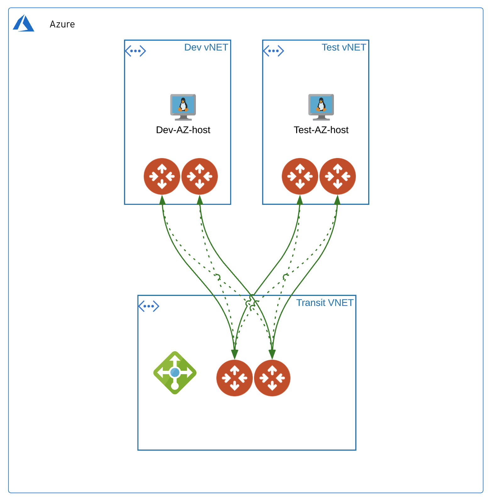

# Aviatrix Transit Azure (insane mode) with Test VMs

### Summary

This repo builds Aviatrix Transit in Azure **insane mode HPE**, spokes attached each with an ubuntu test vm. 
The test VMs will use password authentication (randomly generated), have port 22 open and be provided public IPs. The test vm object(s) will be generated per spoke review output for public ip's.

### BOM

- 1 Aviatrix Transit in Azure with **_N_** Aviatrix spokes defined in terraform.tfvars, i.e. ```spokes = { "Dev" = "10.22.1.0/20" , "Test" = "10.23.3.0/20" }``` that will be attached to Aviatrix Transit Gateway.
- 1 Azure Resource Group with Ubuntu 18.04 VM (iperf3 installed) **_(1 per spoke)_**

### Infrastructure diagram



### Compatibility
Terraform version | Controller version | Terraform provider version
:--- | :--- | :---
0.13 | 6.3 | 2.18

### Modules

Module Name | Version | Description
:--- | :--- | :---
[terraform-aviatrix-modules/azure-transit/aviatrix](https://registry.terraform.io/modules/terraform-aviatrix-modules/azure-transit/aviatrix/latest) | 3.0.0 | This module deploys a VNET, Aviatrix transit gateways.
[terraform-aviatrix-modules/azure-spoke/aviatrix](https://registry.terraform.io/modules/terraform-aviatrix-modules/azure-spoke/aviatrix/latest) | 3.0.0 | This module deploys a VNET and an Aviatrix spoke gateway in Azure and attaches it to an Aviatrix Transit Gateway
[Azure/compute/azurerm](https://registry.terraform.io/modules/Azure/compute/azurerm/0.9.0) | 0.9.0 | Azure Terraform module to deploy virtual machines

### Variables

The variables are defined in ```terraform.tfvars```.

**Note:** ```ha_enabled = false``` controls whether ha is built for spokes. 

```instance_size``` controls the size of all the transit spokes and gateways. 

```test_instance_size``` controls the size of the test vms.

### Prerequisites

- Software version requirements met
- Aviatrix Controller with Access Account in Azure
- Sufficient limits in place for Azure region in scope **_(EIPs, Compute quotas, etc.)_**
- terraform .13 in the user environment ```terraform -v``` **_or use hashicorp/terraform docker image_** Instructions below.
- [Install the the azure cli](https://docs.microsoft.com/en-us/cli/azure/install-azure-cli-macos) on the workstation and authenticate with ```az login```

### Workflow

- Modify ```terraform.tfvars``` _(i.e. access account name, regions, cidrs, etc.)_ and save the file.
- ```terraform init```
- ```terraform plan```
- ```terraform apply --auto-approve```

### Test command examples

You can ssh into the the test vm's created in azure like so...

```ssh azureuser/test_vm_password@public_ip_address```

**test_vm_password,public_ip_address** will be in terraform output

#### iperf

Replace with the private IP of one of the created test vms - check Azure console for the value.
Run the client on one test vm and the server on another test vm.

```
iperf3 -c 10.21.3.20 -i 2 -t 30 -M 1400 -P 1 -p 5201
iperf3 -s -p 5201
```

### Deploy with hashicorp docker image

#### 1) Pull the 13.6 image
```
docker pull hashicorp/terraform:0.13.6
```
#### 2) Init in $PWD with environment variables set
```
docker run -i -t -v $PWD:$PWD -w $PWD \
--env TF_VAR_username=$TF_VAR_username \
--env TF_VAR_password=$TF_VAR_password \
--env TF_VAR_controller_ip=$TF_VAR_controller_ip \
hashicorp/terraform:0.13.6 init
```

#### 3) Plan in $PWD with environment variables set
```
docker run -i -t -v $PWD:$PWD -w $PWD \
--env TF_VAR_username=$TF_VAR_username \
--env TF_VAR_password=$TF_VAR_password \
--env TF_VAR_controller_ip=$TF_VAR_controller_ip \
hashicorp/terraform:0.13.6 plan
```

#### 4) Apply in $PWD with environment variables set
```
docker run -i -t -v $PWD:$PWD -w $PWD \
--env TF_VAR_username=$TF_VAR_username \
--env TF_VAR_password=$TF_VAR_password \
--env TF_VAR_controller_ip=$TF_VAR_controller_ip \
hashicorp/terraform:0.13.6 apply --auto-approve
```


